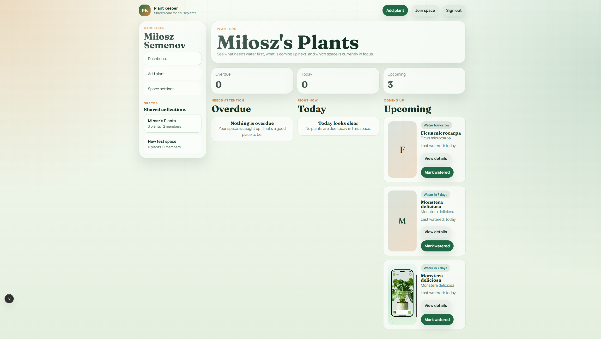

# Plant Keeper

Plant Keeper is a full-stack web application for managing houseplant care.

The app helps track watering schedules, identify plants from photos, and share plant collections with other users.

## Features

- Google authentication
- Automatic personal space creation for each user
- Shared plant spaces with invite links
- Plant photo identification via Plant.id
- AI-generated care profiles for unknown species
- Local species knowledge cache (`plant_species`)
- Dashboard with overdue, today, and upcoming watering tasks
- Watering history tracking
- Daily email reminder job

## Tech stack

Frontend

- Next.js (App Router)
- React
- TypeScript

Backend

- NextAuth (Google OAuth)
- Prisma ORM
- PostgreSQL

Integrations

- Plant.id API
- OpenAI-compatible API
- Resend / SMTP email delivery

## Architecture overview

Business logic is separated into backend services:

- services/
- plants.ts – plant management and watering logic
- plant-id.ts – Plant.id integration
- plant-care.ts – AI care profile generation
- reminders.ts – daily reminder job

AI-generated plant care data is cached in the `plant_species` table so that each species only needs to be generated once.

## Project structure

- app/ Next.js routes and API handlers
- components/ UI components
- services/ business logic
- lib/ shared utilities
- db/ database helpers
- prisma/ Prisma schema
- scripts/ background scripts

## Environment setup

Copy `.env.example` to `.env` and configure:

- DATABASE_URL
- NEXTAUTH_SECRET
- NEXTAUTH_URL
- GOOGLE_CLIENT_ID
- GOOGLE_CLIENT_SECRET
- PLANT_ID_API_KEY
- AI_API_KEY
- AI_API_URL
- AI_MODEL
- EMAIL_FROM
- APP_URL
- CRON_SECRET

Optional email providers:

- RESEND_API_KEY
- SMTP_HOST
- SMTP_PORT
- SMTP_USER
- SMTP_PASSWORD

## Local development

Install dependencies:
npm install

Generate Prisma client:
npm run db:generate

Run migrations:
npm run db:migrate

Seed demo data:
npm run db:seed

Start development server:
npm run dev

## Reminder job

Daily watering reminders can be triggered by:
npm run job:reminders

or via the protected API route:
POST /api/jobs/reminders

## Notes

- Plant images are stored locally in `public/uploads`.
- If no email provider is configured, invite and reminder emails are logged instead of sent.
- `plant_species` acts as a persistent knowledge cache for plant care data.

